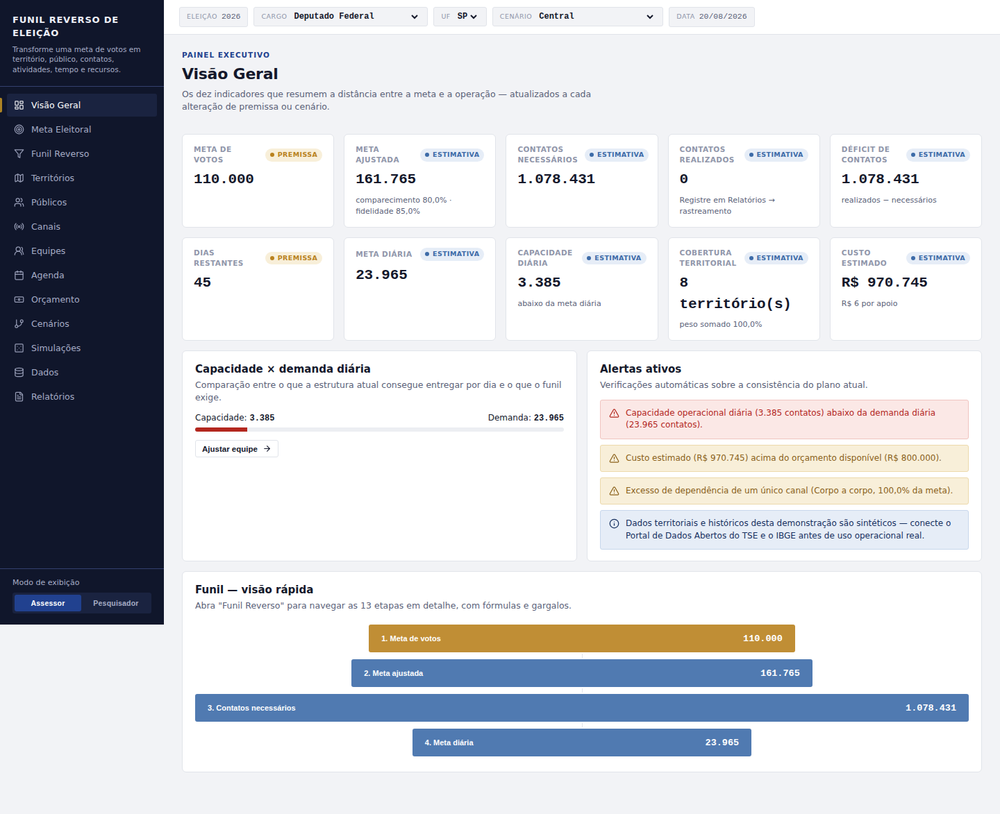

# correria — Funil Reverso de Eleição

Calculadora, simulador e painel operacional de planejamento eleitoral. Transforma uma **meta de votos** em **território, público, canais, contatos, atividades, equipe, tempo e orçamento** — com fórmulas abertas, cenários comparáveis e simulação de incerteza (Monte Carlo).

Aplicativo estático (React + Vite), sem backend. Todos os cálculos rodam no navegador; nada é enviado para um servidor.



## O que este projeto é (e o que não é)

- **É** uma calculadora completa e funcional do funil reverso: meta ajustada, canais de conversão (cada um com cadeia própria, não uma taxa média única), rede/lideranças, distribuição territorial, capacidade de equipe, orçamento, cenários e simulação Monte Carlo.
- **Não é** conectado ao Portal de Dados Abertos do TSE nem ao IBGE. Os dados de eleitorado, comparecimento histórico e território usados por padrão são **sintéticos/ilustrativos**, propositalmente identificados na interface com um selo (Dado oficial / Dado histórico / Premissa / Estimativa). Veja o módulo **Dados** dentro do app para o que precisa ser conectado antes de qualquer uso operacional real.
- **Não é** um preditor eleitoral. A simulação de incerteza mostra faixas de variação a partir de premissas, não uma previsão de resultado.

O exemplo padrão ao abrir o app (Deputado Federal, SP, meta de 110.000 votos, 20% de abstenção, 85% de fidelidade, 45 dias, 15% de conversão no corpo a corpo) reproduz exatamente os números do exemplo obrigatório do briefing original: meta ajustada ≈ **161.765**, contatos necessários ≈ **1.078.431**, meta diária ≈ **23.965**.

## Stack

- [React 18](https://react.dev/) + [Vite](https://vitejs.dev/)
- [Recharts](https://recharts.org/) (gráficos)
- [lucide-react](https://lucide.dev/) (ícones)
- Sem CSS framework — sistema visual próprio (IBM Plex Sans/Mono) definido dentro de `src/App.jsx`
- Persistência local via `localStorage` do navegador (modelos salvos e rastreamento operacional) — não há conta de usuário nem sincronização entre dispositivos

## Rodando localmente

Pré-requisitos: [Node.js](https://nodejs.org/) 18 ou superior.

```bash
npm install
npm run dev
```

Abra `http://localhost:5173`.

Para gerar a versão de produção localmente:

```bash
npm run build
npm run preview
```

## Publicando no GitHub Pages

Este pacote já inclui um workflow do GitHub Actions (`.github/workflows/deploy.yml`) que builda e publica o site automaticamente a cada push na branch `main`.

### 1. Criar o repositório e enviar o código

```bash
cd correria
git init
git add .
git commit -m "Primeira versão do Funil Reverso de Eleição"
git branch -M main
git remote add origin https://github.com/SEU-USUARIO/correria.git
git push -u origin main
```

(Crie antes o repositório vazio "correria" em https://github.com/new — sem README, sem .gitignore, sem license, para não conflitar com o que já vem neste pacote.)

### 2. Ativar o GitHub Pages

No repositório, vá em **Settings → Pages → Build and deployment → Source** e selecione **GitHub Actions**. O workflow já incluso cuida do resto — a cada push em `main`, o site é reconstruído e publicado.

O site ficará disponível em:

```
https://SEU-USUARIO.github.io/correria/
```

### Se o nome do repositório for diferente de "correria"

O `vite.config.js` define `base: "/correria/"`, necessário para os arquivos estáticos carregarem corretamente em um site de projeto do GitHub Pages (`usuario.github.io/nome-do-repo/`). Se você:

- **Renomear o repositório**: troque `/correria/` pelo novo nome em `vite.config.js`.
- **Usar um domínio próprio (CNAME)** ou um repositório `usuario.github.io` (site de usuário): troque para `base: "/"`.

## Estrutura do projeto

```
correria/
├── src/
│   ├── App.jsx        # aplicativo inteiro: engines, dados, componentes, views
│   ├── main.jsx        # ponto de entrada React
│   └── index.css       # reset mínimo (o design system vive dentro de App.jsx)
├── public/
│   └── .nojekyll       # evita que o GitHub Pages processe o site como Jekyll
├── .github/workflows/
│   └── deploy.yml       # build + deploy automático no GitHub Pages
├── index.html
├── vite.config.js
└── package.json
```

### Arquitetura interna do `App.jsx`

O arquivo é longo (é um app completo em um único componente, de propósito — mais simples de auditar e portar), mas segue uma ordem fixa:

1. **Utilidades** de formatação (`fmtInt`, `fmtPct`, `fmtMoney`…)
2. **Motor de cálculo (engines)** — funções puras, sem estado, uma por domínio: `electorateEngine`, `funnelEngine`, `conversionEngine`, `networkEngine`, `territorialEngine`, `capacityEngine`, `budgetEngine`, `scenarioEngine`, `historicalEngine`, `electoralRuleEngine`, além do simulador Monte Carlo. Essas funções não sabem nada sobre React — podem ser copiadas para um backend (Node, Python etc.) sem alterações caso o projeto cresça para precisar de dados reais e processamento no servidor.
3. **Dados** — UFs, municípios de exemplo (São Paulo), cargos, canais de conversão. Claramente marcados como ilustrativos onde for o caso.
4. **`computeAll(cfg)`** — orquestra os engines a partir da configuração atual; é a única função que a interface consulta para obter números.
5. **Componentes de apoio** (badges de proveniência do dado, disclosure de fórmula, KPI, campos de formulário, o diagrama de funil).
6. **Views** — uma função por item do menu lateral (Visão Geral, Meta Eleitoral, Funil Reverso, Territórios, Públicos, Canais, Equipes, Agenda, Orçamento, Cenários, Simulações, Dados, Relatórios).
7. **`App`** — estado global, persistência em `localStorage`, roteamento entre views.

## Limitações conhecidas / próximos passos

- **Sem conexão real com TSE/IBGE.** O módulo Dados já mapeia as fontes reais (Portal de Dados Abertos do TSE, IBGE) e o formato em que estão disponíveis; falta o conector de importação (o TSE distribui os dados em lote via CSV/ZIP por ano, não como uma API REST tradicional — um passo de ETL agendado é mais adequado do que uma chamada em tempo real).
- **Sem backend.** Modelos salvos e rastreamento operacional ficam no `localStorage` do navegador — não sincronizam entre pessoas da campanha nem entre dispositivos. Se isso vira um requisito, os engines em `App.jsx` já estão isolados o suficiente para virar uma API (ex.: Node/Express ou Python/FastAPI) sem reescrever a lógica de cálculo.
- **Território detalhado só para São Paulo.** O recorte por município (com pesos, presença, capacidade e logística próprios) hoje só existe para SP, o estado do exemplo obrigatório do briefing original. As demais 26 UFs entram no cálculo em nível agregado.
- **Regras eleitorais como parâmetros, não constantes.** O simulador de cadeiras proporcionais usa o método D'Hondt (matematicamente bem definido), mas o quociente eleitoral, o quociente partidário e o limiar individual são todos editáveis na tela — confirme sempre a resolução do TSE vigente para o pleito antes de decisões reais.
- **Bundle único (~185 kB gzip).** Para um site institucional maior, vale dividir em chunks (`build.rollupOptions.output.manualChunks` no `vite.config.js`) — não foi feito aqui para manter a estrutura simples de auditar.

## Licença

Nenhuma licença foi definida neste pacote. Adicione um arquivo `LICENSE` antes de tornar o repositório público, caso pretenda permitir reuso por terceiros.
