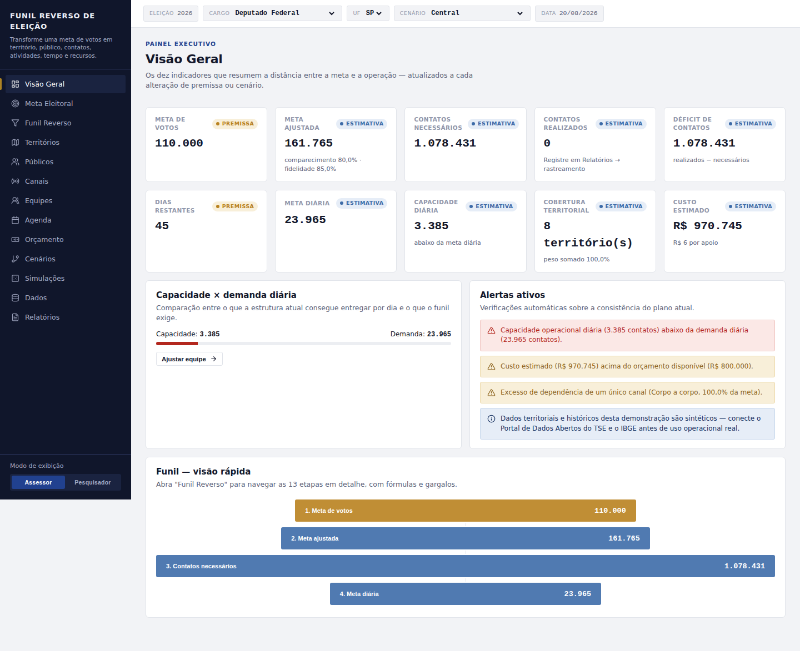

# correria — Funil Reverso de Eleição

Calculadora, simulador e painel operacional de planejamento eleitoral. Transforma uma **meta de votos** em **território, público, canais, contatos, atividades, equipe, tempo e orçamento** — com fórmulas abertas, cenários comparáveis e simulação de incerteza (Monte Carlo).

Aplicativo estático (React + Vite), sem backend. Todos os cálculos rodam no navegador e **nenhuma requisição sai da página** — as fontes são empacotadas junto com o app, não carregadas de um CDN.



## O que este projeto é (e o que não é)

- **É** uma calculadora completa do funil reverso: meta ajustada, canais de conversão (cada um com cadeia própria, não uma taxa média única), rede/lideranças, distribuição territorial, capacidade de equipe, orçamento, cenários e simulação Monte Carlo.
- **Não faz consulta em tempo real.** Os dados vêm dos arquivos originais do Portal de Dados Abertos do TSE, baixados e agregados por `scripts/gerar-dados-tse.mjs`, que escreve `src/dados-tse.js`. É uma fotografia com data: eleitorado de 14/07/2026, comparecimento apurado em 2022 e 2018. Nenhuma requisição sai da página em uso. O módulo **Dados** mostra, para cada indicador, o órgão, o arquivo, a data de referência, o método de apuração e o link para a origem.
- **Não é** um preditor eleitoral. A simulação de incerteza mostra faixas de variação a partir de premissas, não uma previsão de resultado.
- **Não exibe precisão que não tem.** Tudo que depende de taxa de conversão aparece no painel como faixa ("923 mil – 1,34 mi"), não como número exato. Ver *Incerteza no lugar de precisão falsa*, abaixo.

## Incerteza no lugar de precisão falsa

O funil inteiro pende de uma taxa que quase nenhuma campanha conhece: quantos contatos viram voto. Exibir `1.078.431 contatos` — sete dígitos significativos — a partir de um "15% de conversão no corpo a corpo" chutado é dar uma resposta falsa com cara de exatidão, e isso é pior do que não ter ferramenta.

Por isso a simulação de Monte Carlo deixou de ser um extra escondido atrás do modo Pesquisador e passou a ser **o que a Visão Geral mostra**. Todo indicador derivado de conversão aparece como faixa de percentis 10 a 90 — 80% de 3.000 simulações —, com o valor central logo abaixo e o cálculo determinístico disponível no botão de informação:

| Indicador | Antes | Agora |
|---|---|---|
| Contatos necessários | `1.078.431` | `923 mil – 1,34 mi` (central 1,1 mi) |
| Meta diária | `23.965` | `20,5 mil – 29,7 mil` (central 24,4 mil) |
| Custo estimado | `R$ 928.745` | `805 mil – 1,14 mi` (central 945 mil) |

A simulação roda em ~40 ms e é recalculada a cada mudança de premissa, com semente fixa — mesma configuração, mesma faixa. Os limites (abstenção ±7 p.p., fidelidade −12/+8 p.p., conversão de 70% a 130% do valor informado) são editáveis em **Simulações**.

O que **não** vira faixa continua exato de propósito, e o contraste é informativo: a meta de votos é uma decisão sua, dias restantes é um fato do calendário, capacidade diária sai de parâmetros que você controla. Faixa é para o que depende de uma taxa que ninguém mediu.

O exemplo padrão ao abrir o app (Deputado Federal, SP, meta de 110.000 votos, 20% de abstenção, 85% de fidelidade, 45 dias, 15% de conversão no corpo a corpo) produz meta ajustada **161.765**, contatos necessários **1.078.431** e meta diária **23.965**. Esses três números estão travados por teste automatizado (`npm test`).

## Procedência dos dados

Todo número externo mora em `src/dados-tse.js`, que é **arquivo gerado — não editar à mão**. A geração é reproduzível:

```bash
node scripts/gerar-dados-tse.mjs   # baixa os ZIPs do TSE, agrega e reescreve src/dados-tse.js
```

| O que | De onde | Referência | Como é apurado |
|---|---|---|---|
| Eleitorado por UF e município, zonas eleitorais | TSE, `perfil_eleitorado_2026.zip` | 14/07/2026 | Soma de `QT_ELEITORES` por UF e por município; zonas = `NR_ZONA` distintos |
| Comparecimento e abstenção | TSE, `detalhe_votacao_munzona_{2022,2018}.zip` | 02/10/2022 e 07/10/2018 | `QT_COMPARECIMENTO ÷ QT_APTOS`, 1º turno, cargo Deputado Federal, sem voto em trânsito |
| Cadeiras na Câmara por UF | STF / TSE | 01/10/2025 | 513 cadeiras; o STF suspendeu a redistribuição e manteve para 2026 a composição eleita em 2022 (a de 531 vale a partir de 2030) |
| Cadeiras na Assembleia | Constituição, art. 27 | — | Calculado, não tabelado: o triplo até 36; acima de 12 federais, +1 estadual por federal excedente |
| Datas do pleito | Lei 9.504/1997, art. 1º | — | Calculadas a partir do ano: 1º turno no primeiro domingo de outubro |

O total nacional apurado aqui — 158.745.463 eleitores, incluindo o exterior — confere com o número divulgado pelo TSE para as eleições de 2026.

**O que não é dado e por isso não está lá:** desempenho histórico da candidatura, presença de campanha, capacidade instalada e dificuldade logística por território. Não existe fonte pública para nenhum dos quatro. Eles entram como premissa editável na tabela de Territórios, começam neutros (50) e, enquanto ninguém os informa, não desempatam nada. Versões anteriores traziam valores inventados por município — São Paulo com "histórico 0,62", Osasco com 0,37 — que pareciam medição e enviesavam a distribuição da meta.

## Stack

- [React 18](https://react.dev/) + [Vite](https://vitejs.dev/)
- [Recharts](https://recharts.org/) (gráficos) e [lucide-react](https://lucide.dev/) (ícones)
- [@fontsource](https://fontsource.org/) — IBM Plex Sans/Mono auto-hospedadas
- Sem CSS framework — sistema visual próprio, definido em `src/App.jsx`
- Persistência local via `localStorage` — não há conta de usuário nem sincronização entre dispositivos

## Rodando localmente

Pré-requisitos: [Node.js](https://nodejs.org/) 18 ou superior.

```bash
npm install
npm run dev     # http://localhost:5173
npm test        # testes do motor de cálculo
npm run build   # build de produção
npm run preview # serve o build
```

Duas ferramentas auxiliares:

```bash
npm run dados:tse   # rebaixa os arquivos do TSE e regenera src/dados-tse.js
npm run audit:ui    # aciona todo botão, select e slider das 13 telas e acusa
                    # os que não produzem efeito nenhum (precisa do dev server
                    # rodando e do Chrome com --remote-debugging-port=9222)
```

`audit:ui` existe porque teste de motor não pega afordância falsa: um `<button>`
com cursor de mão que não faz nada passa em qualquer teste unitário. A assinatura
que ele compara inclui texto, classes, estados ARIA, valores de formulário, rota
e downloads interceptados — controles cujo efeito não é textual (um chip que só
muda de estado, um botão que baixa arquivo) contam como funcionando, e um
controle já ativo que não reage não é acusado.

## Estrutura do projeto

```
correria/
├── src/
│   ├── engine.js         # motor de cálculo + configuração (puro, sem React)
│   ├── dados-tse.js      # ARQUIVO GERADO — dados do TSE com fonte e data
│   ├── engine.test.mjs   # testes do motor (node --test)
│   ├── App.jsx           # interface: design system, componentes e as 13 views
│   ├── main.jsx          # ponto de entrada + error boundary + fontes
│   └── index.css         # reset mínimo
├── scripts/
│   ├── gerar-dados-tse.mjs   # baixa os arquivos do TSE e regenera dados-tse.js
│   └── auditar-ui.mjs        # varredura de controles sem efeito nas 13 telas
├── public/.nojekyll
├── .github/workflows/deploy.yml
├── index.html
├── vite.config.js
└── package.json
```

O motor foi separado da interface para que a afirmação "funções puras, testáveis isoladamente" fosse verdadeira: `src/engine.js` não importa React e roda direto no Node, o que permite testar as regras eleitorais e o funil sem montar a UI. Ele pode ser movido para um backend (Node/Express, Python/FastAPI) sem alteração.

### Organização do `engine.js`

1. **Utilidades** de formatação e merge (`fmtInt`, `fmtPct`, `deepMerge`…)
2. **Engines** — uma por domínio: `electorateEngine`, `funnelEngine`, `conversionEngine`, `networkEngine`, `territorialEngine`, `capacityEngine`, `budgetEngine`, `electoralRuleEngine`, `scenarioEngine`
3. **Monte Carlo** — `mulberry32` (semeado, reprodutível), `triangular`, `histogram`, `defaultBounds`, `runMonteCarlo` (devolve faixas de meta ajustada, contatos, meta diária e custo)
4. **Dados** — cargos, canais e etapas do funil (o dado externo vem de `dados-tse.js`)
5. **Configuração** — `defaultConfig()`, `SCHEMA_VERSION` e `migrateConfig()`
6. **`computeAll(cfg, tracking, hoje)`** — orquestra tudo; é a única função que a interface consulta

## Regra proporcional implementada

O módulo proporcional segue os arts. 106 a 109 da Lei 9.504/1997, com a redação da Lei 14.211/2021:

1. Quociente eleitoral: `QE = votos válidos / vagas`
2. Quociente partidário: `QP = parte inteira de (votos do partido / QE)`
3. Sobras distribuídas uma a uma por maiores médias: `média = votos / (vagas obtidas + 1)`
4. Só concorre às sobras o partido com **≥ 80% do QE**; se nenhum alcançar, todos concorrem (§3º)
5. Só ocupa vaga o candidato com **≥ 20% do QE**

**Simplificações declaradas na própria interface:** não modelamos o esgotamento da lista de candidatos do partido nem coligações majoritárias. Os parâmetros (vagas, votos válidos, votação da legenda) são editáveis — as vagas vêm da UF e do cargo, mas podem ser sobrescritas. Confirme sempre a resolução do TSE vigente para o pleito antes de qualquer decisão real.

## Verificações automáticas de viabilidade

O app não aceita silenciosamente uma meta impossível. A cada alteração ele checa, entre outras coisas:

- meta acima do eleitorado que deve comparecer na circunscrição (teto físico);
- meta desproporcional à circunscrição para uma disputa proporcional;
- meta abaixo do mínimo nominal de 10% do quociente eleitoral;
- penetração exigida por território acima do plausível (a coluna *penetração* em Territórios mostra quanto dos votos locais cada meta territorial exige);
- capacidade diária **e** acumulada no período abaixo da demanda;
- soma das participações dos canais e dos pesos territoriais fora de 100%;
- divergência entre "dias de campanha" e a janela declarada na Agenda;
- ritmo de execução abaixo do planejado, comparado ao registro operacional;
- data final da Agenda que não coincide com o 1º turno do ano escolhido na barra de contexto — se o plano está contando prazo para a eleição errada, o alerta é crítico;
- premissa de abstenção distante em mais de 5 pontos da abstenção medida na circunscrição.

## Limitações conhecidas / próximos passos

- **A atualização dos dados é manual.** `scripts/gerar-dados-tse.mjs` precisa ser rodado à mão quando o TSE publica novos arquivos; não há agendamento. O TSE distribui em lote (CSV/ZIP por ano), então um ETL agendado é o caminho, não uma chamada em tempo real.
- **Sem dados do IBGE.** Indicadores socioeconômicos e malhas territoriais não entram em nenhum cálculo hoje.
- **Sem backend.** Modelos salvos e rastreamento operacional ficam no `localStorage` do navegador — não sincronizam entre pessoas da campanha nem entre dispositivos.
- **Território detalhado até o 12º município de cada UF.** Todas as 27 UFs têm recorte municipal — os 12 maiores por eleitorado. O que sobra entra como um bucket explícito ("Restante do estado"), para que a meta não seja distribuída como se os demais municípios não existissem. Um recorte mais fino exigiria carregar os 5.570 municípios.
- **O `recharts` responde por ~150 kB gzip** do bundle, já isolado em um chunk próprio. Carregá-lo sob demanda apenas nas três telas com gráfico reduziria mais o carregamento inicial.
- **Faixas etárias e segmentos temáticos são escolhas da equipe**, não recortes do eleitorado real — dependem do conector do TSE para carregar volume por faixa.

## Publicando no GitHub Pages

O workflow em `.github/workflows/deploy.yml` builda e publica a cada push na `main`. Em **Settings → Pages → Build and deployment → Source**, selecione **GitHub Actions**.

O `vite.config.js` define `base: "/correria/"`, necessário para um site de projeto (`usuario.github.io/nome-do-repo/`). Se renomear o repositório, troque o `base`; se usar domínio próprio (CNAME) ou um repositório `usuario.github.io`, use `base: "/"`.

## Licença

Nenhuma licença foi definida neste pacote. Adicione um arquivo `LICENSE` antes de tornar o repositório público, caso pretenda permitir reuso por terceiros.
